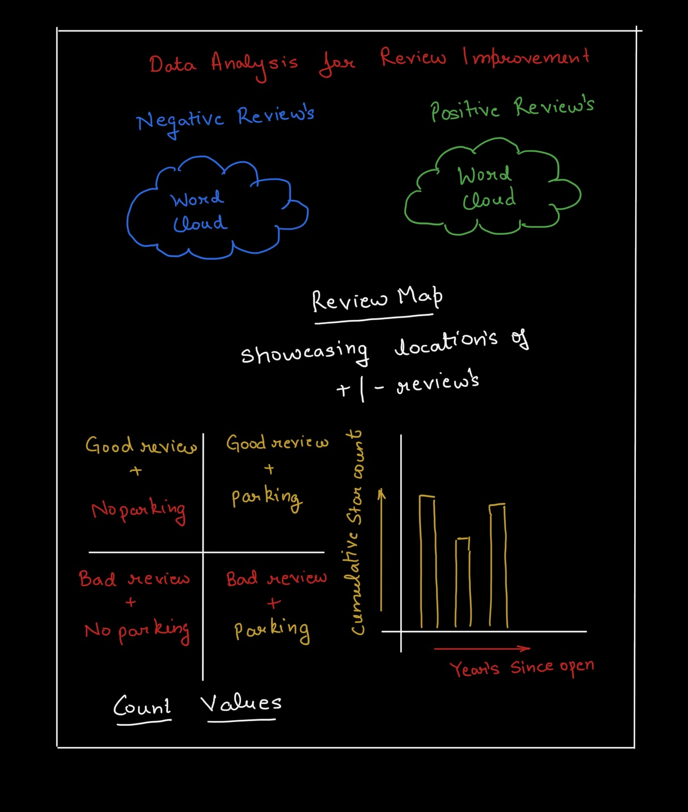
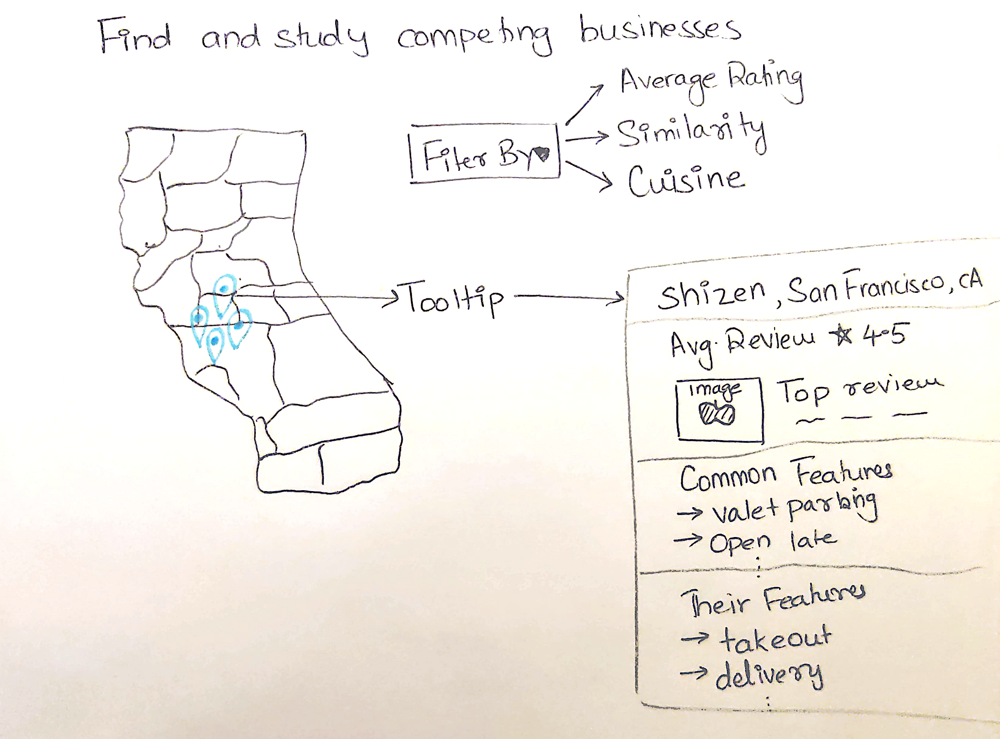
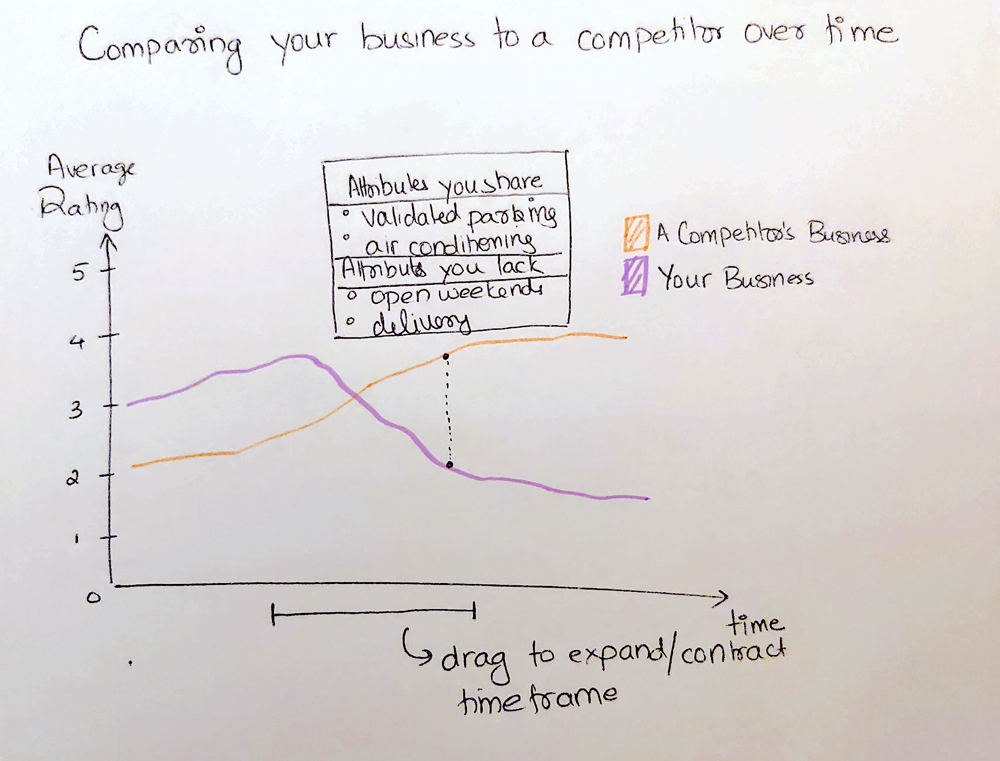
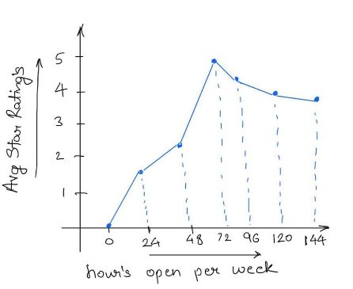
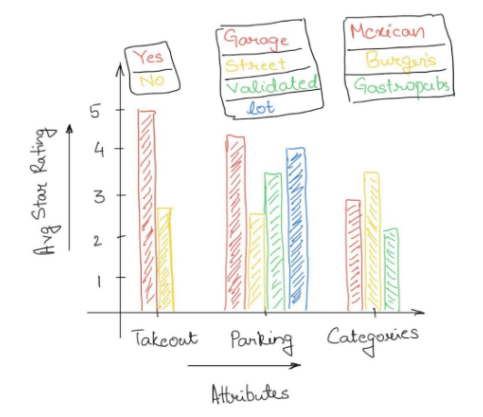

# Final Project Proposal

**GitHub Repo URL**: https://github.com/CMU-IDS-2022/final-project-mass-squad

## Goal

The main goal of this application will be to aid restaurant owners to compare their businesses to other similar businesses and explore avenues of improvement for their own business. Essentially, our application will aid business owners to explore their competitors: either businesses in the same locality, serving similar cuisines, or based on any other relevent attributes. It will enable the users to answer questions such as - 
 
  - What businesses are most similar to their own business based on various attributes?
  - How the competitors compare to their own business in terms of customer ratings, customer satisfaction, pricing and amenities offered?
  - What attributes of the competitor businesses make them more appealing to customers?
  - What attributes of the user's business are favourable among its customers?
  - What improvements would enable the business owner establish an upper hand over its competitors based on the what favourable attributes are currently missing?
 
The users will be able to interact with various visualizations and filters within the application in order to explore the questions above and gain insight for business strategy enhancement.

## Dataset

Yelp is a website that publishes crowdsourced reviews on businesses. As of February 2022, the site has 244 million reviews [1]. The Yelp Dataset is data on a subset of businesses, reviews and users present on the Yelp website. It is publicly available online [2] as a set of the following 6 JSON files:
 - business.json: This file contains data about businesses on Yelp including location, attributes like WiFi or parking and open hours.
 - review.json: This file contains review data including the content, star rating, reviewer’s user id, the corresponding business id which can be mapped to business.json and the number of useful votes the review received.
 - user.json: This file has metadata on the users present on the site including name, user id, number of reviews they’ve written, their fans, their friends etc.
 - checkin.json: This file has timings of checkins on different businesses.
 - tip.json: This file has data on tips i.e. short suggestions written for different businesses by the users.
 - photo.json: This file has image data including the corresponding business id, caption and label signifying the category like food or menu etc.

While the dataset delves into a variety of sections on the Yelp website, we plan to use only some of these sections. Our project will heavily focus on the first three categories i.e. businesses, reviews and users. 

 - [1] https://www.yelp-ir.com/overview/default.aspx
 - [2] Dataset source: https://www.yelp.com/dataset

## Solutions

The focus of this project will be to develop a web application that uses interactive visualizations to enable business owners to understand the landscape of similar businesses based on their attributes and reviews. The motivation behind this application is to provide business owners with a way to compare their business with similar businesses on several different dimensions of their choosing. 

The first thrust of our efforts will focus on implementing a method to compute similarity between businesses. This could be based on characteristics of the business (for example what cuisines a restaurant serves or whether they are open on weekends), or based on ratings and textual reviews made by patrons of the business. 

The second thrust of the project will involve developing a wide range of visualizations that facilitate exploring the attributes of businesses similar to a queried business. An example of one such visualization is one that presents how the ratings of a restaurant have changed over time in comparison to others offering similar cuisine in the area. Another could include an interactive map of restaurants in an area where a user can interact with pins on the map to study their attributes. A visualization of this sort could help an aspiring business owner understand where to position their business based on attributes of business that are popular in certain areas. 

The third thrust of the project involves predictive modeling of review ratings based on attributes of the business. A use case for this feature would be to identify attributes that will help boost your business’ ratings and reviews.

## Brief Sketch

## Sketches and Data Analysis

### Data Preprocessing

### System Design 

The following sketches illustrate how we plan to present data to users in a way that facilitates the goal of our project - enabling business owners to compare their businesses to their competitors and understand what factors lead to better or worse reviews. 

The Yelp dataset contains location information for every business. We use this location data to drop pins of competing business on a map of the city in which the business resides. The goal of this visualization is to enable a business owner to identify competing businesses in their vicinity. This visualization will allow a reader to choose how to select businesses - by star rating, similarity to their own business, cuisine or other relevant attributes. Each selected business will correspond to a pin on the map. Each pin will have an associated tooltip that provides a summary of the bussiness - the name, location, average rating, most up/down voted review, an image, features shared with your business and features exclusive to this business (not shared with your business). 

Once a business owner has identified their competition, they might want to see how thier business' reviews have changed over time in comparison their competitors. It is not enough to simply see a declining or improving trend of ratings compared to their competitors. A reader should be able to understand why or how this trend has come to be. This visualization plots line graphs of a business' average ratings with that of a competitor over time. To enable an understanding of how this trend came to be, both lines will have a shared toolip indicating which attributes the businesses had in common at that point of time, and which ones the competing bussiness had but the reader's business did not. This will help make associations between business attributes and ratings. This visualization will also feature a time range selector to allow the reader to study changes in a specific timeframe

The following graphs give a brief description of how specific categories impact the overall distribution of ratings, thus giving the business owners an idea of where they need improvement in these specific categories:

